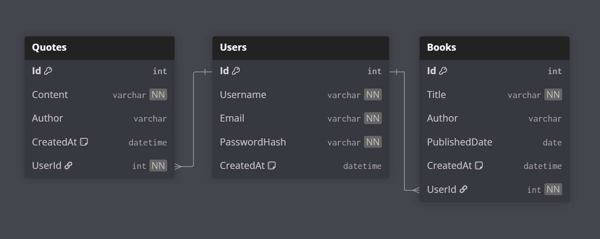

# Bookly
Bookly är en CRUD applikation som hjälper användare att hålla koll på sina favorit böcker och citat. 

## innehållsförteckning
- [Beskrivning](#-Beskrivning)
- [Använda tekniker](#️-använda-tekniker)
- [Projektperiod](#-Projektperiod)

## Beskrivning
Bookly har följande features;

**Autentisering via JWT**:
- Registrering
- Inloggning
- Utlogning

**Böcker**
- Hämtning av alla böcker som tillhör ett specifikt konto
- Skapa böcker för ett konto
- Uppdatera böcker för ett konto
- Radera böcker för ett konto

**Citat**
- Hämtning av alla citat som tillhör ett specifikt konto
- Skapa citat för ett konto
- Uppdatera citat för ett konto
- Radera citat för ett konto

Bookly har CRUD funktionalitet via följande endpoints;

**Böcker**:
- GET ``/book`` för att hämta alla böcker
- GET ``/book/:id`` för att hämta en specifik bok
- POST ``/book`` för att skapa en ny bok
- PUT ``/book/:id`` för att uppdatera en befintlig bok
- DELETE ``/book/:id`` för att ta bort en bok

**Citat**:
- GET ``/quote`` för att hämta alla citat
- GET ``/quote/:id`` för att hämta ett specifikt citat
- POST ``/quote`` för att skapa en ny citat
- PUT ``/quote/:id`` för att uppdatera en befintlig citat
- DELETE ``/quote/:id`` för att ta bort ett citat

**Användare**:
- POST ``/user/register`` för att skapa en ny användare
- POST ``/user/login`` för att logga in på ett befintligt användarkonto 

Själva databasen var modellerad utifrån följande antaganden:
- Användare kan bara se och manipulera böcker och citat som tillhör sitt egna konto
- Böcker och citat är två separata entiteter. En Citat är inte kopplat till en bok

Nedan följer en bild över databas schemat:


## Använda tekniker
**Backend**
- .NET - Backend ramverk
- Entity Framework - databas modelleringen och queries
- C#

**Frontend**
- Angular - Frontend ramverk
- TypeScript
- HTML
- BootStrap - CSS ramverk
- Fontawesome - Ikonbibliotek

**Övrigt**
- Git - versionshantering

## Starta applikationen

**Backend**:

Navigera in i backend mappen:
```bash
cd backend
```

Starta .Net:
```bash
dotnet run
```

**Frontend**:

Navigera in i frontend mappen:
```bash
cd frontend
```

Installera beroenden:
```bash
npm install
```

Starta angular:
```bash
ng serve --open
```

## Projektperiod
2026-06-02 - 2026-06-16

