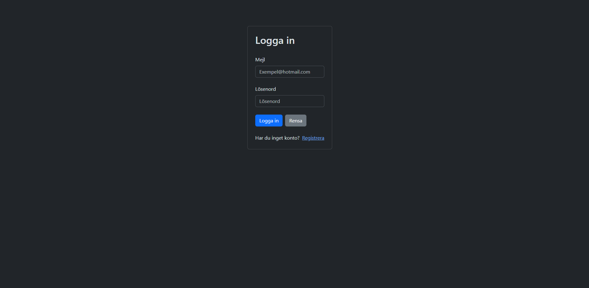
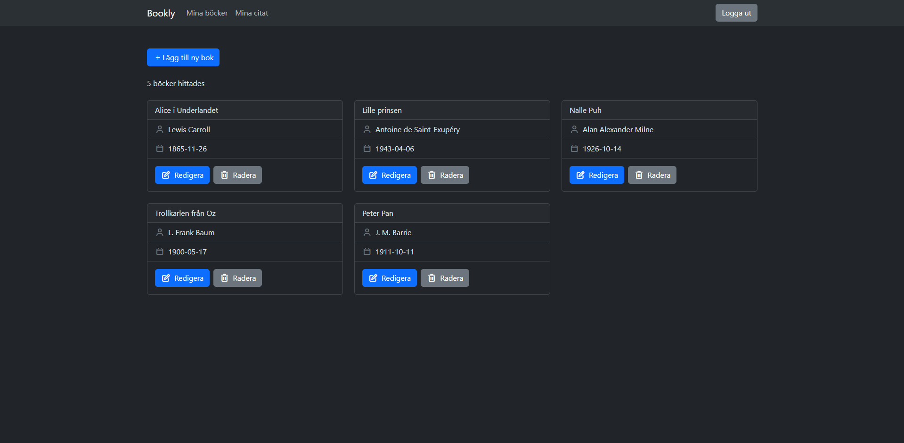
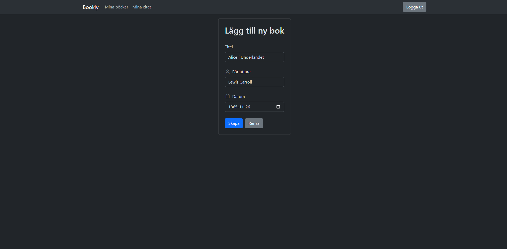
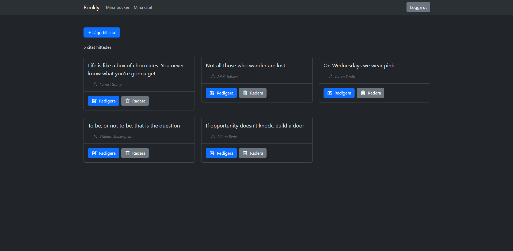
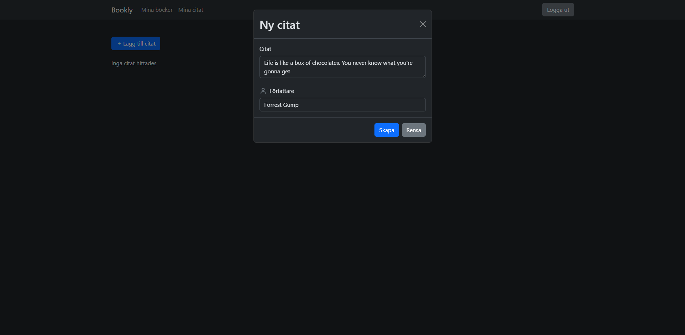
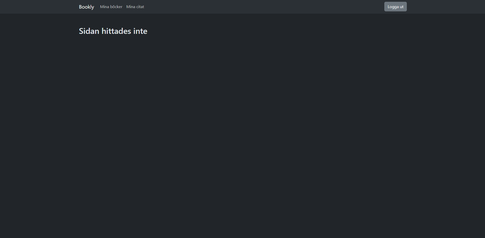
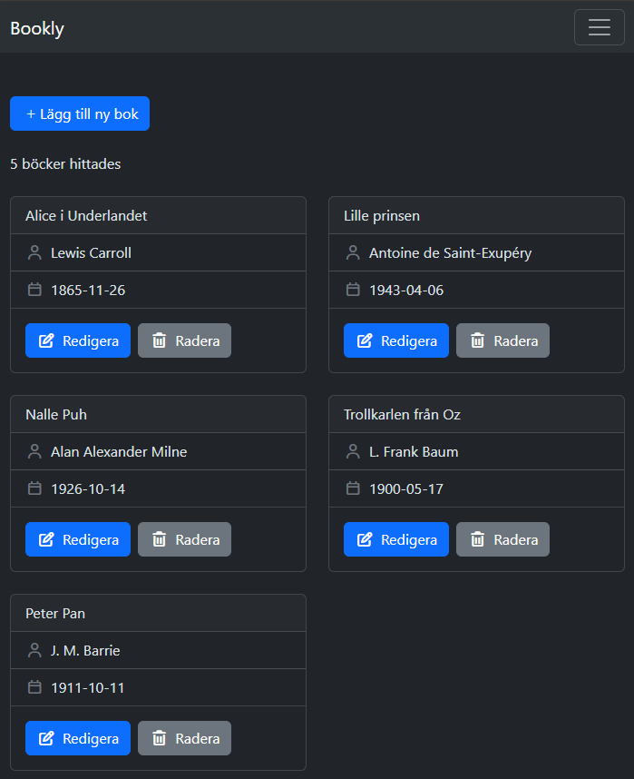

# Bookly
Bookly är en fullstack CRUD-applikation byggd med Angular och .NET. 
Applikationen låter användare hålla koll på sina favoritböcker och citat via ett personligt konto med JWT autentisering. 

## innehållsförteckning
- [Beskrivning](#Beskrivning)
- [Använda tekniker](#️Använda-tekniker)
- [Starta applikationen](#Starta-applikationen)
- [Filstruktur](#Filstruktur)
- [Projektperiod](#Projektperiod)
- [Skärmdumpar](#Skärmdumpar)

## Beskrivning
Bookly har följande features;

**Autentisering via JWT**:
- Registrering
- Inloggning
- Utloggning

**Böcker**
- Hämtning av alla böcker som tillhör ett specifikt konto
- Skapa böcker för ett konto
- Uppdatera böcker för ett konto
- Radera böcker för ett konto

**Citat**
- Hämtning av alla citat som tillhör ett specifikt konto
- Skapa citat för ett konto
- Uppdatera citat för ett konto
- Radera citat för ett konto

Bookly har CRUD funktionalitet via följande endpoints;

**Böcker**:
- GET ``/book`` för att hämta alla böcker
- GET ``/book/:id`` för att hämta en specifik bok
- POST ``/book`` för att skapa en ny bok
- PUT ``/book/:id`` för att uppdatera en befintlig bok
- DELETE ``/book/:id`` för att ta bort en bok

**Citat**:
- GET ``/quote`` för att hämta alla citat
- GET ``/quote/:id`` för att hämta ett specifikt citat
- POST ``/quote`` för att skapa ett ny citat
- PUT ``/quote/:id`` för att uppdatera ett befintlig citat
- DELETE ``/quote/:id`` för att ta bort ett citat

**Användare**:
- POST ``/user/register`` för att skapa en ny användare
- POST ``/user/login`` för att logga in på ett befintligt användarkonto 

Själva databasen var modellerad utifrån följande antaganden:
- Användare kan bara se och manipulera böcker och citat som tillhör sitt egna konto
- Böcker och citat är två separata entiteter. Ett citat är inte kopplat till en bok

Nedan följer en bild över databas schemat.


## Använda tekniker
**Backend**
- .NET - Backend ramverk
- Entity Framework - databas modelleringen och queries
- C#

**Frontend**
- Angular - Frontend ramverk
- TypeScript
- HTML
- BootStrap - CSS ramverk
- Fontawesome - Ikonbibliotek

**Övrigt**
- Git - versionshantering

## Starta applikationen

**Backend**:

Navigera in i backend mappen:
```bash
cd backend
```

Starta .Net:
```bash
dotnet run
```

**Frontend**:

Navigera in i frontend mappen:
```bash
cd frontend
```

Installera beroenden:
```bash
npm install
```

Starta angular:
```bash
ng serve --open
```

Applikationens körs på http://localhost:4200/

## Filstruktur
Frontenden och Backenden blev separerade i olika mappar. Därför ser strukturen ut på följande sätt:
```
library-app/
├── backend/
│   ├── Data/
│   │   ├── AppDbContext.cs
│   │   └── image.png
│   ├── DTOs/
│   ├── Migrations/
│   ├── Models/
│   │   ├── Book.cs
│   │   ├── Quote.cs
│   │   └── User.cs
│   ├── Properties/
│   ├── Routes/
│   │   ├── Books.cs
│   │   ├── Quotes.cs
│   │   └── Users.cs
│   ├── Services/
│   │   └── PasswordService.cs
│   ├── .env.example
│   ├── appsettings.Development.json
│   ├── appsettings.json
│   ├── backend.csproj
│   ├── backend.http
│   └── Program.cs
├── frontend/
│   ├── .vscode/
│   ├── public/
│   ├── src/
│   │   ├── app/
│   │   │   ├── components/
│   │   │   │   ├── book-card/
│   │   │   │   │   ├── book-card.component.html
│   │   │   │   │   └── book-card.component.ts
│   │   │   │   ├── layout/
│   │   │   │   │   ├── layout.component.html
│   │   │   │   │   └── layout.component.ts
│   │   │   │   ├── nav/
│   │   │   │   │   ├── nav.component.html
│   │   │   │   │   └── nav.component.ts
│   │   │   │   └── quote-card/
│   │   │   │       ├── quote-card.html
│   │   │   │       └── quote-card.ts
│   │   │   ├── guards/
│   │   │   │   └── auth.guard.ts
│   │   │   ├── models/
│   │   │   │   ├── auth-response.model.ts
│   │   │   │   ├── book.model.ts
│   │   │   │   ├── login.model.ts
│   │   │   │   ├── quote.model.ts
│   │   │   │   └── register.model.ts
│   │   │   ├── pages/
│   │   │   │   ├── auth-form/
│   │   │   │   │   ├── auth-form.html
│   │   │   │   │   └── auth-form.ts
│   │   │   │   ├── book-form/
│   │   │   │   │   ├── book-form.component.html
│   │   │   │   │   └── book-form.component.ts
│   │   │   │   ├── book-page/
│   │   │   │   │   ├── book-page.html
│   │   │   │   │   └── book-page.ts
│   │   │   │   ├── login-page/
│   │   │   │   │   ├── auth-form.html
│   │   │   │   │   └── auth-form.ts
│   │   │   │   ├── page-not-found/
│   │   │   │   │   ├── page-not-found.html
│   │   │   │   │   └── page-not-found.ts
│   │   │   │   └── quote-page/
│   │   │   │       ├── quote-page.html
│   │   │   │       └── quote-page.ts
│   │   │   ├── services/
│   │   │   │   ├── auth.service.ts
│   │   │   │   ├── book.service.ts
│   │   │   │   └── quote.service.ts
│   │   │   ├── stores/
│   │   │   │   ├── auth.store.ts
│   │   │   │   ├── book.store.ts
│   │   │   │   └── quote.store.ts
│   │   │   ├── app.config.ts
│   │   │   ├── app.routes.ts
│   │   │   └── app.ts
│   │   ├── environments/
│   │   │   ├── environment.development.ts
│   │   │   └── environment.ts
│   │   ├── index.html
│   │   ├── main.ts
│   │   └── styles.css
│   ├── .gitignore
│   ├── .prettierrc
│   ├── angular.json
│   ├── package-lock.json
│   ├── package.json
│   ├── tsconfig.app.json
│   ├── tsconfig.json
│   └── vercel.json
├── .gitignore
└── README.md
```
## Projektperiod
2026-06-02 - 2026-06-16

## Skärmdumpar
Nedan följer skärmdumpar från applikationen.

Inloggning och registreringssidan:


Vy över alla böcker som tillhör ett användarkonto.


Vyn för att skapa en ny bok. Redigera funktionen använder samma formulär med en annan titel.


över alla citat som tillhör ett användarkonto.


Vyn för att skapa ett ny citat. Redigera funktionen använder samma formulär med en annan titel.


404 sida för routes som inte existerar


Mobil vy
